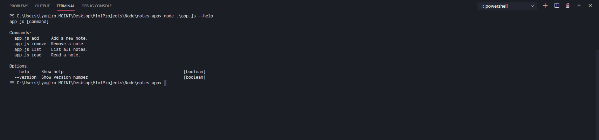
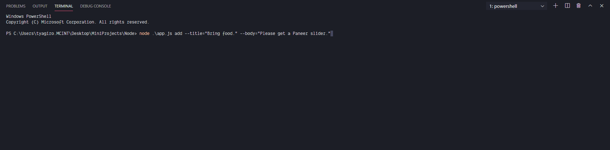
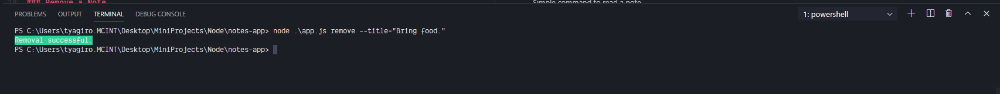
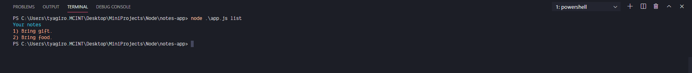
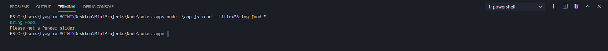

# Notes application using Command Line.

## Introduction

Created a simple repository that actually helps a user add notes using command line arguments. Created using NodeJS.

## Things that I learnt

- Module system in Node JS.
- Using external libraries, self created libraries and global modules with node.
- Using Command line arguments to create a full fledged application.
- File system manipulation.

## Details and Screenshot

All the notes are added to the notes.json file that we create. Validations are done as a part of creation.

### Add a Note

Simple command to add a note.

### Remove a Note

Simple command to remove a note.

### List all Notes

Simple command to list all the notes.

### Read a Note

Simple command to read a note.

